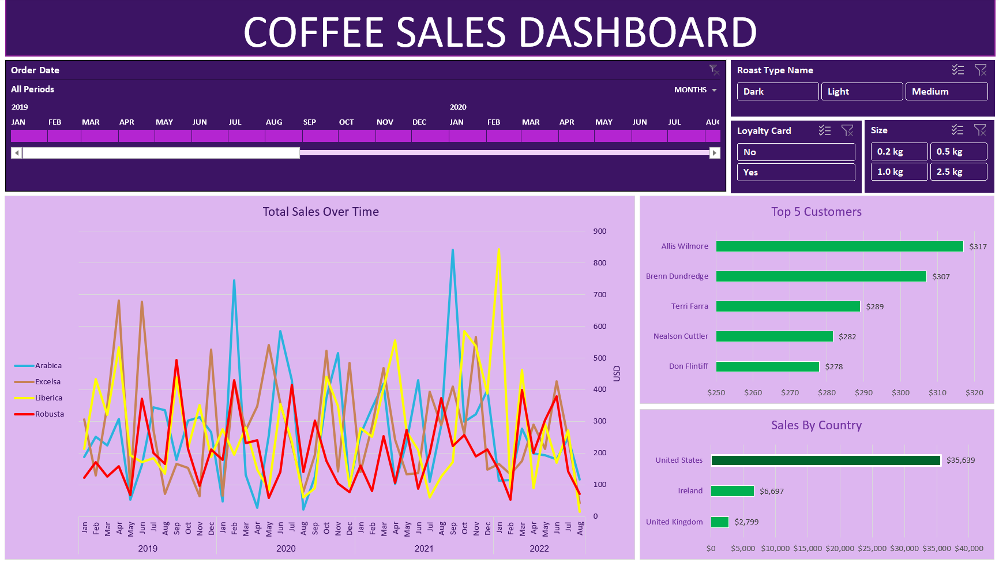

# Coffee Sales Dashboard 

## Overview

This project analyzes coffee sales data to identify **sales trends, top-performing countries, products, and customers**.

The raw data was transformed into an interactive Excel dashboard that provides a clear overview of sales performance and makes key patterns easier to identify.

## Business Problem

Raw transaction data can make it difficult to quickly understand where sales are coming from and which factors contribute to overall performance.

This dashboard was built to answer key business questions such as:

* How do sales change over time?
* Which countries generate the most sales?
* Which roast types and coffee sizes perform best?
* How does loyalty card usage relate to sales?
* Who are the top customers?

## Dashboard



## Key Analysis

The dashboard focuses on:

* **Sales Trends** — tracking performance over time
* **Country Analysis** — comparing sales across countries
* **Roast Type** — analyzing performance by roast
* **Coffee Size** — comparing different product sizes
* **Loyalty Card** — examining customer purchasing behavior
* **Top Customers** — identifying the highest-value customers

## Tools & Techniques

* Microsoft Excel
* Pivot Tables
* Pivot Charts
* Slicers
* Data Cleaning
* Data Analysis
* Data Visualization

## Project Structure

```text
Coffee-Sales-Dashboard/
│
├── dashboard/
│   └── coffee-sales-dashboard.png
│
├── data/
│   └── coffee_sales.xlsx
│
└── README.md
```

## Outcome

The final dashboard turns raw coffee sales data into a **clear visual analysis** that makes trends, comparisons, and customer patterns easier to understand.
 
